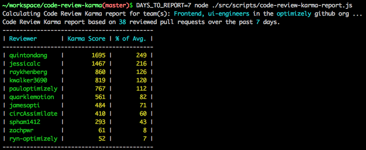

# code-review-karma

## Overview

This project is intended to help engineering teams gain better high-level insight into their
team members' relative contributions to pull request code reviews. A report is prepared that
gives each member of the specified github team a code review **karma score**.  This score is
intended to reflect the level of contribution that team member is making toward reviewing
and approving the team's pull requests.

## Karma Score Details

- **50** karma points per **approved** pull request
- For each **approved** pull request, karma points equivalent to the # of lines of **added code** in that pull request.
- For each **commented on**, but not **approved** pull request, karma points equivalent to **25%** of the # of lines of **added code** in that pull request.

## Running the Command Line Script

See below to use the command line script: (Assumes use of [nvm](https://github.com/creationix/nvm))

```sh
nvm install && npm install
export GITHUB_ACCESS_TOKEN=my_personal_access_token
export GITHUB_ORG=my_org
export GITHUB_TEAMS=team1,team2
node ./src/scripts/code-review-karma-report.js
```

Sample output:



## Slack Integration

... coming soon!
